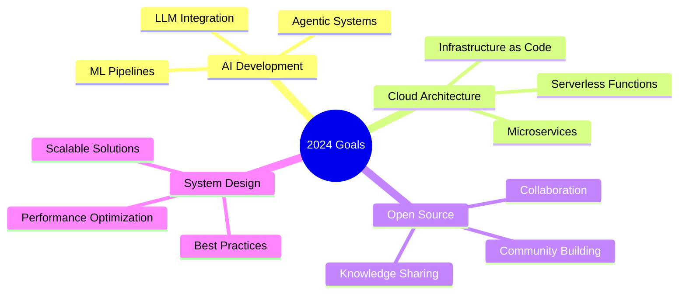

<div align="center">
  <h1>Full Stack Developer & Agentic Ai Enthusiast</h1>
  <p>Building modern applications with AI, Cloud, and cutting-edge technologies</p>
</div>

<div align="center">
  <h2>Technology Stack</h2>
  
  <!-- Frontend & Core Technologies -->
  <br>
  
  <!-- Backend & Database -->
  <br>
  
  <!-- Cloud, Tools & Others -->
  
</div>
<div align="center">
  
# 👋 Hey there! I'm a Full Stack Developer & AI Innovator


<p align="center">
  
  
  
</p>

</div>

---

## 🚀 About Me

```typescript
const developer = {
  name: "Nikhil Prasad R",
  role: "Full Stack Developer & AI Enthusiast",
  location: "India 🇮🇳",
  currentFocus: ["Agentic AI", "Serverless Architecture", "System Design"],
  communities: ["Open Source Contributor", "Tech Blogger"],
  funFact: "I turn coffee into code and ideas into reality ☕→💻"
};
```

<div align="center">

## 🛠️ Tech Arsenal

### 🎨 Frontend Magic


### ⚡ Backend Power  


### 🗄️ Database & Storage


### ☁️ Cloud & DevOps


### 🤖 AI & ML Tools


</div>

---

## 📊 GitHub Analytics

<div align="center">
  
  
</div>

<div align="center">
  
</div>

<div align="center">
  
</div>

---

## 🏆 Featured Projects

<div align="center">

| 🎯 Project | 💡 Description | 🔗 Links |
|------------|----------------|----------|
| **🎤 Voice Emotion Detection** | Real-time emotion analysis from voice using ML | [](https://github.com/Nikhilprasad-r/voice-emotion-detection) |
| **🎬 Motion Capture System** | Advanced motion tracking with MediaPipe | [](https://github.com/Nikhilprasad-r/Motion-Capture) |
| **🖼️ CIFAR-10 ResNet** | Image classification with deep learning | [](https://github.com/Nikhilprasad-r/CIFAR10-ResNet) |
| **📁 LAN File Transfer** | High-speed file sharing over local network | [](https://github.com/Nikhilprasad-r/LAN-file-transfer) |

</div>

---

## 🌟 Open Source Contributions

<div align="center">

| Project | Contribution | Impact | Status |
|---------|-------------|---------|--------|
| **Microsoft Azure** | Documentation & Bug Fixes | Improved developer experience |  |
| **Node.js** | Core improvements & Docs | Enhanced performance |  |

</div>

---

## 📈 Contribution Graph

<div align="center">
  
</div>

---

## 🎯 Current Focus Areas

<div align="center">



</div>

---

## 📫 Let's Connect & Collaborate!

<div align="center">

[](https://www.linkedin.com/in/nikhilprasad-r/)
[](https://github.com/Nikhilprasad-r)
[](https://twitter.com/your-handle)
[](https://your-portfolio.com)
[](mailto:your-email@gmail.com)

### 💭 Random Dev Quote


---

<details>
<summary>🎮 When I'm not coding...</summary>
<br>

- 🎵 Exploring new music genres
- 📚 Reading tech blogs and research papers  
- 🏃‍♂️ Running and staying active
- 🎮 Gaming (strategy and puzzle games)
- 🌱 Contributing to open source projects
- ☕ Perfecting my coffee brewing skills

</details>

---

<div align="center">
  
</div>

</div>
<br/>

<details>
<summary>🛠️ Detailed Technical Expertise</summary>

### Frontend
- **Frameworks**: Next.js, React, React Native
- **Language**: TypeScript
- **Expertise**: Server Components, State Management, Mobile Development

### Backend
- **Frameworks**: Nest.js, Express
- **Runtime**: Node.js, Bun
- **Patterns**: Microservices, REST, GraphQL

### Cloud & Infrastructure
- **AWS**: Lambda, CDK, API Gateway
- **Azure**: Functions, App Service
- **Tools**: Serverless Framework, IaC

### Specialized Skills
- **AI**: Agentic AI, LLM Integration
- **Media**: Audio/Video Processing
- **Practices**: Open Source, System Design
</details>

<details>
<summary>🌟 Featured Projects</summary>

<table>
  <tr>
    <td align="center">
      <b>Roadmap Generation</b><br/>
      Real-time emotion detection from voice<br/>
      <a href="https://github.com/Nikhilprasad-r/voice-emotion-detection">View Project</a>
    </td>
    <td align="center">
      <b>Motion Capture</b><br/>
      Motion capture system using MediaPipe<br/>
      <a href="https://github.com/Nikhilprasad-r/Motion-Capture">View Project</a>
    </td>
  </tr>
  <tr>
    <td align="center">
      <b>CIFAR-10 with ResNet</b><br/>
      Image classification using ResNet architecture<br/>
      <a href="https://github.com/Nikhilprasad-r/CIFAR10-ResNet">View Project</a>
    </td>
    <td align="center">
      <b>LAN File Transfer App</b><br/>
      File transfer application for LAN networks<br/>
      <a href="https://github.com/Nikhilprasad-r/LAN-file-transfer">View Project</a>
    </td>
  </tr>
</table>
</details>

<details>
<summary>🤝 Open Source Contributions</summary>

<table>
  <tr>
    <th>Project</th>
    <th>Contribution</th>
    <th>Status</th>
  </tr>
   <tr>
    <td>Azure</td>
    <td>Azure Docintelligence Documentation improvements and bug fixes</td>
    <td></td>
  </tr>
  <tr>
    <td>Node.js</td>
    <td>Documentation improvements and bug fixes</td>
    <td></td>
  </tr>
</table>
</details>

<div align="center">
  <h2>GitHub Statistics</h2>
  
  
  
</div>

<div align="center">
  <h2>Connect With Me</h2>
  <a href="https://www.linkedin.com/in/nikhilprasad-r/">
    
  </a>
  <a href="https://github.com/Nikhilprasad-r">
    
  </a>
</div>

<div align="center">
  <h2>Current Focus</h2>
  <table>
    <tr>
      <td align="center">🤖<br/>AI Development</td>
      <td align="center">☁️<br/>Function as a Service</td>
      <td align="center">🎯<br/>System Design</td>
      <td align="center">🌱<br/>Open Source</td>
    </tr>
  </table>
</div>

---

<div align="center">
  <p>Looking to collaborate? Let's build something amazing together!</p>
  
</div>
