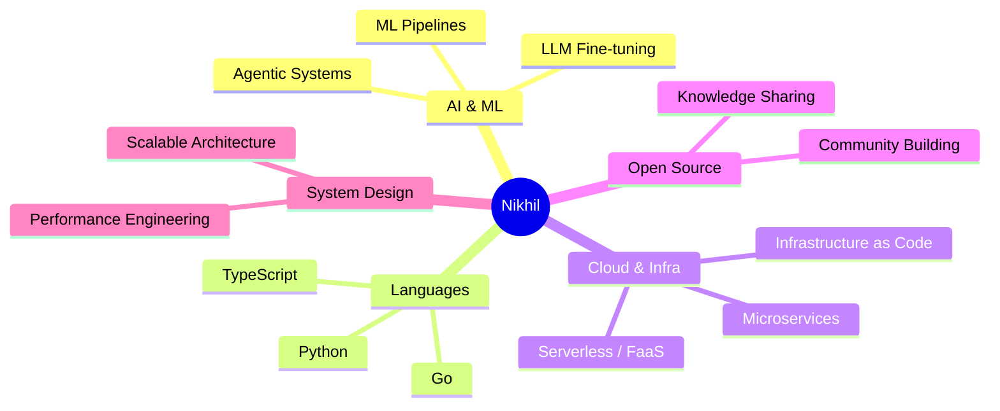

<div align="center">


<br/>


<br/>

<p>
  
  
  
</p>

</div>

---

## `$ whoami`

```typescript
const nikhil = {
  name        : "Nikhil Prasad R",
  role        : ["Full Stack Developer", "AI Innovator", "Open Source Contributor"],
  location    : "India 🇮🇳",
  languages   : ["TypeScript", "JavaScript", "Python", "Go"],
  currentFocus: ["Agentic AI Systems", "Serverless Architecture", "LLM Integration"],
  philosophy  : "Ship fast. Learn faster. Build what matters. ⚡",
} as const;
```

---

## 🧰 Tech Arsenal

<div align="center">

### 🎨 Frontend


### ⚡ Backend


### 🗄️ Databases & Storage


### ☁️ Cloud & DevOps


### 🤖 AI / ML


</div>

---

## 📊 GitHub Analytics

<div align="center">
  
  
</div>

<div align="center">
  
</div>

<div align="center">
  
</div>

---

## 🚀 Featured Projects

<div align="center">

| Project | Description | Tech | Links |
|---------|-------------|------|-------|
| 🎤 **Voice Emotion Detection** | Real-time emotion analysis from voice using ML | `Python` `TensorFlow` `Audio DSP` | [](https://github.com/Nikhilprasad-r/voice-emotion-detection) |
| 🎬 **Motion Capture System** | Advanced motion tracking with MediaPipe | `Python` `OpenCV` `MediaPipe` | [](https://github.com/Nikhilprasad-r/Motion-Capture) |
| 🖼️ **CIFAR-10 ResNet** | Image classification with deep learning | `Python` `PyTorch` `ResNet` | [](https://github.com/Nikhilprasad-r/CIFAR10-ResNet) |
| 📁 **LAN File Transfer** | High-speed file sharing over local network | `Go` `TypeScript` `Networking` | [](https://github.com/Nikhilprasad-r/LAN-file-transfer) |

</div>

---

## 🌟 Open Source Contributions

<div align="center">

| Project | Contribution | Status |
|---------|-------------|--------|
| **Microsoft Azure** | Azure DocIntelligence — documentation improvements & bug fixes |  |
| **Node.js** | Core documentation improvements & bug fixes |  |

</div>

---

## 🎯 2024 Focus Map

<div align="center">


```mermaid
mindmap
  root((Nikhil))
    AI & ML
      Agentic Systems
      LLM Fine-tuning
      ML Pipelines
    Languages
      TypeScript
      Python
      Go
    Cloud & Infra
      Serverless / FaaS
      Microservices
      Infrastructure as Code
    Open Source
      Community Building
      Knowledge Sharing
    System Design
      Scalable Architecture
      Performance Engineering
```

</div>

---

## 📈 Contribution Snake

<div align="center">
  
</div>

---

## 📫 Let's Connect

<div align="center">

[](https://www.linkedin.com/in/nikhilprasad-r/)
[](https://github.com/Nikhilprasad-r)
[](https://twitter.com/your-handle)
[](https://your-portfolio.com)
[](mailto:your-email@gmail.com)

<br/>


</div>

---

<details>
<summary>🔧 Detailed Technical Expertise</summary>
<br/>

**Frontend**
- Frameworks: `Next.js`, `React`, `React Native`
- Language: `TypeScript`, `JavaScript`
- Expertise: Server Components, App Router, State Management, Mobile Development

**Backend**
- Frameworks: `NestJS`, `Express`, `Gin` (Go), `FastAPI` (Python)
- Runtimes: `Node.js`, `Bun`, `Go`, `Python`
- Patterns: Microservices, REST, GraphQL, gRPC

**AI / ML**
- Tools: `LangChain`, `LlamaIndex`, `OpenAI SDK`, `Anthropic SDK`
- Frameworks: `TensorFlow`, `PyTorch`, `Hugging Face`
- Focus: Agentic AI, LLM Integration, Retrieval-Augmented Generation

**Cloud & Infrastructure**
- AWS: `Lambda`, `CDK`, `API Gateway`, `ECS`
- Azure: `Functions`, `App Service`, `DocIntelligence`
- Tools: `Docker`, `Kubernetes`, `Serverless Framework`, `Terraform`

**Languages at a glance**
| Language | Proficiency | Primary Use |
|----------|-------------|-------------|
| TypeScript | ████████████ Expert | Frontend / Backend |
| Python | ██████████░░ Advanced | AI/ML, Scripting, APIs |
| Go | ████████░░░░ Proficient | CLIs, High-perf Services |
| JavaScript | ████████████ Expert | Full Stack |

</details>

<details>
<summary>🎮 Beyond the Terminal</summary>
<br/>

- 🎵 Exploring new music genres
- 📚 Reading research papers on AI & distributed systems
- 🏃 Running and staying active
- 🎮 Strategy & puzzle games
- ☕ Obsessively perfecting coffee brewing
- 🌱 Mentoring & contributing to open source

</details>

---

<div align="center">
  
</div>
